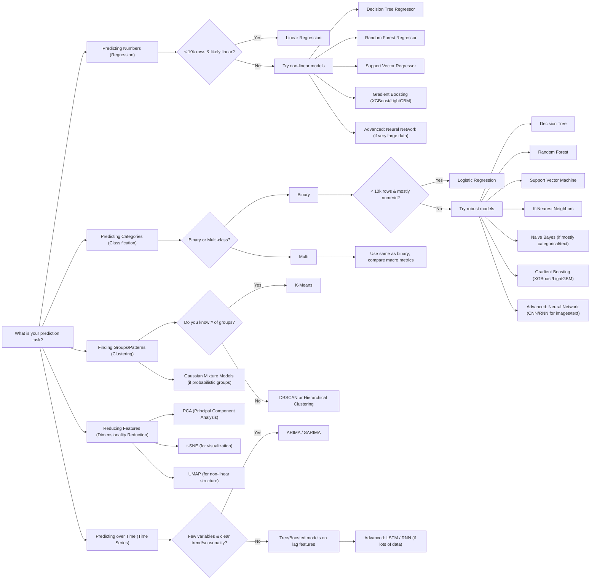

# Machine_Learning_From_Scratch

```mermaid
flowchart LR
    Start["What is your prediction task?"]

    Start --> Reg["Predicting Numbers (Regression)"]
    Start --> Class["Predicting Categories (Classification)"]
    Start --> Clust["Finding Groups/Patterns (Clustering)"]
    Start --> DimRed["Reducing Features (Dimensionality Reduction)"]
    Start --> Time["Predicting over Time (Time Series)"]

    %% Regression Branch
    Reg --> RegSmall{"< 10k rows & likely linear?"}
    RegSmall -->|Yes| LinReg["Linear Regression"]
    RegSmall -->|No| RegNonLinear["Try non-linear models"]
    RegNonLinear --> TreeReg["Decision Tree Regressor"]
    RegNonLinear --> RFReg["Random Forest Regressor"]
    RegNonLinear --> SVR["Support Vector Regressor"]
    RegNonLinear --> GBReg["Gradient Boosting (XGBoost/LightGBM)"]
    RegNonLinear --> AdvReg["Advanced: Neural Network (if very large data)"]

    %% Classification Branch
    Class --> ClassSimple{"Binary or Multi-class?"}
    ClassSimple --> Binary
    ClassSimple --> Multi

    Binary --> ClassSmall{"< 10k rows & mostly numeric?"}
    ClassSmall -->|Yes| LogReg["Logistic Regression"]
    ClassSmall -->|No| ClassComplex["Try robust models"]
    ClassComplex --> TreeClf["Decision Tree"]
    ClassComplex --> RFClf["Random Forest"]
    ClassComplex --> SVM["Support Vector Machine"]
    ClassComplex --> KNN["K-Nearest Neighbors"]
    ClassComplex --> NB["Naive Bayes (if mostly categorical/text)"]
    ClassComplex --> BoostClf["Gradient Boosting (XGBoost/LightGBM)"]
    ClassComplex --> AdvClf["Advanced: Neural Network (CNN/RNN for images/text)"]

    Multi --> SameAsBinary["Use same as binary; compare macro metrics"]

    %% Clustering Branch
    Clust --> ClustSmall{"Do you know # of groups?"}
    ClustSmall -->|Yes| KMeans["K-Means"]
    ClustSmall -->|No| DBSCAN["DBSCAN or Hierarchical Clustering"]
    Clust --> GMM["Gaussian Mixture Models (if probabilistic groups)"]

    %% Dimensionality Reduction Branch
    DimRed --> PCA["PCA (Principal Component Analysis)"]
    DimRed --> TSNE["t-SNE (for visualization)"]
    DimRed --> UMAP["UMAP (for non-linear structure)"]

    %% Time Series Branch
    Time --> FewVars{"Few variables & clear trend/seasonality?"}
    FewVars -->|Yes| ARIMA["ARIMA / SARIMA"]
    FewVars -->|No| TimeML["Tree/Boosted models on lag features"]
    TimeML --> LSTM["Advanced: LSTM / RNN (if lots of data)"]

```
